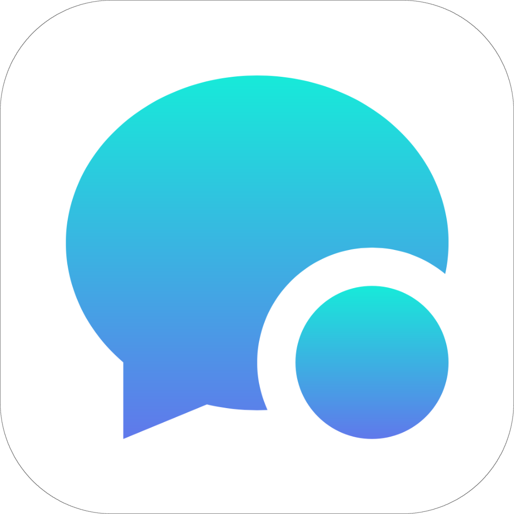
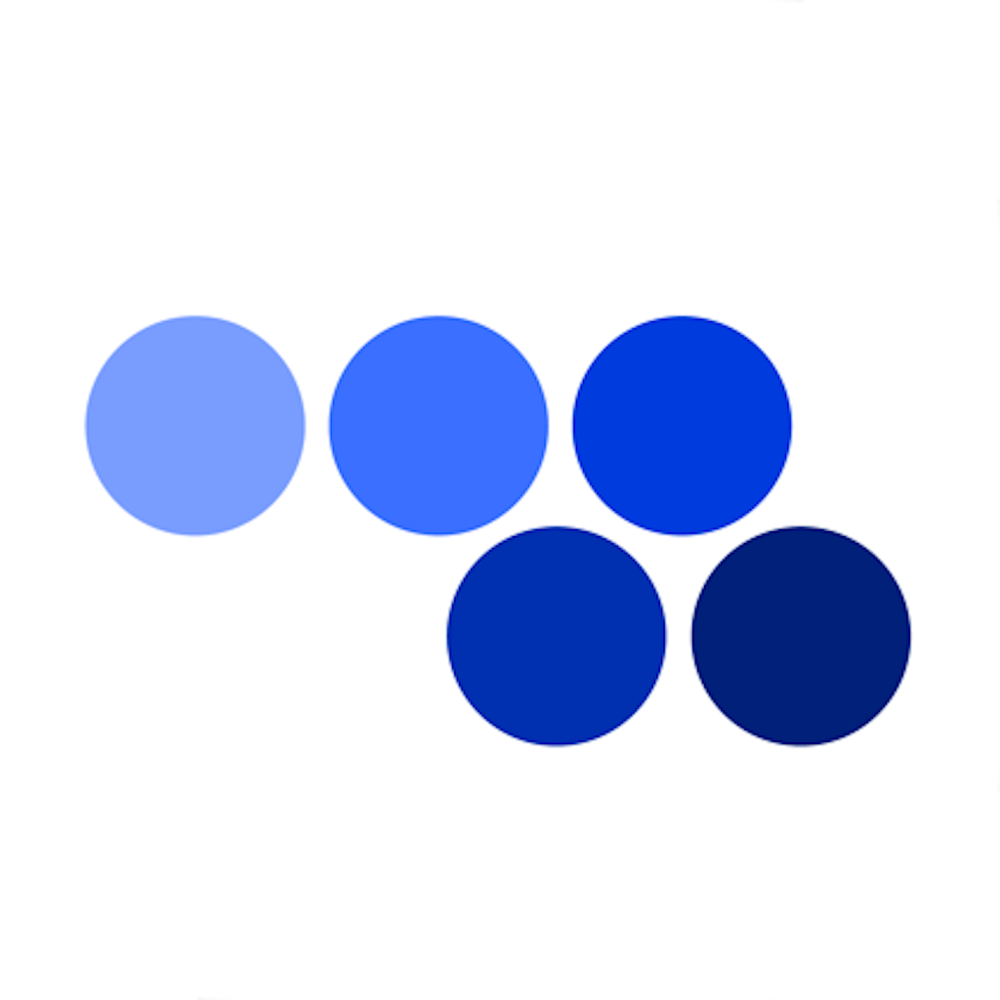
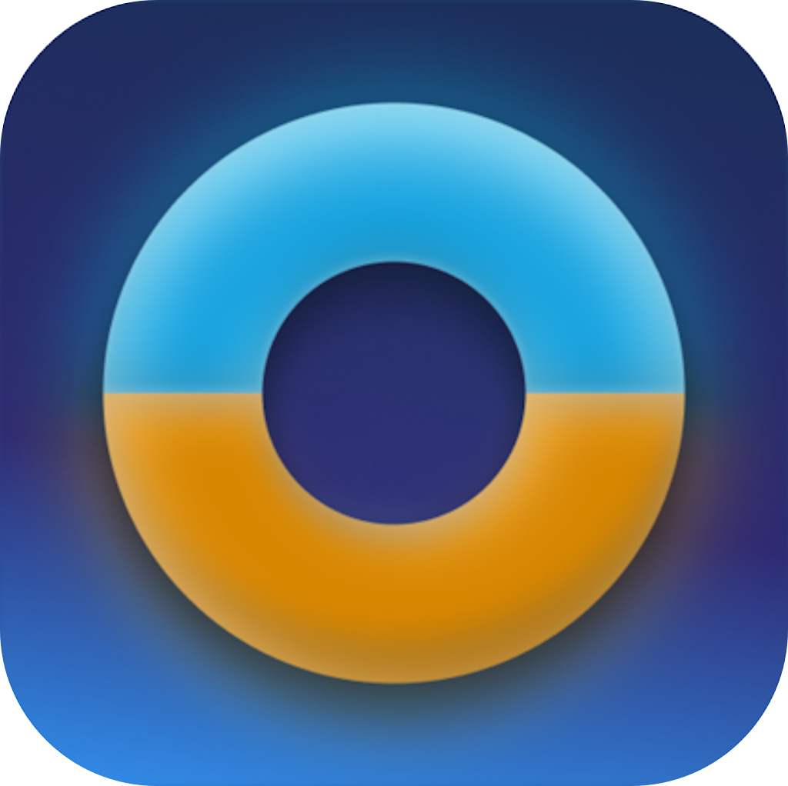

# Hi there, I'm Dom Montalto, an iOS Developer 👋🏼
👨🏽‍💻 Coding professionally since 2018  🎓 First Class Honours in Software Engineering  ✉️ How to reach me: [dommontalto@icloud.com](mailto:dommontalto@icloud.com)

# 💻 iOS Tech Stack:

<picture>
    <source media="(prefers-color-scheme: dark)" srcset="https://raw.githubusercontent.com/dommontalto/dommontalto/output/github-snake-dark.svg" />
    <source media="(prefers-color-scheme: light)" srcset="https://raw.githubusercontent.com/dommontalto/dommontalto/output/github-snake.svg" />
    
</picture>

 
 

<table border="0" cellspacing="0" cellpadding="0">
    <tr>
        <td valign="center">
            

            <h1 align="center">Nomadify</h1>
            

                
            

            
Nomadify is a digital companion for remote workers with full group chat functionality, visa info, currency conversion, health advice, and a MapKit powered map for coworking and coliving spaces.

            <ul>
                <li>Built using SwiftUI with an MVVM architecture, async/await, and full unit test coverage.</li>
                <li>Firebase powers group chat, authentication, storage, and backend services, with dependencies managed through Swift Package Manager.</li>
                <li>Caching keeps the app lightweight and fast, and images are compressed on upload.</li>
                <li>Fully supports both light and dark mode.</li>
            </ul>
            

                
                
                
                
                
                
                
                
                
                
                
                
                
            

            
        </td>
        <td align="center" width="300" valign="top">
            
        </td>
    </tr>
</table>

 

<table border="0" cellspacing="0" cellpadding="0">
    <tr>
        <td align="center" width="300" valign="top">
            
        </td>
        <td valign="center">
            

            <h1 align="center">Hx</h1>
            

                
            

            
Hx is a smart control system built for high end homes and yachts, letting users control lighting, climate, entertainment, and more from one place.

            <ul>
                <li>Built using UIKit with an MVVM architecture, RxSwift, and full unit test coverage.</li>
                <li>Uses CocoaPods for dependency management and supports CI/CD pipelines.</li>
                <li>Atlassian tools for team collaboration and issue tracking.</li>
                <li>Fully supports both light and dark mode, and is optimised for iPad.</li>
            </ul>
            

                
                
                
                
                
                
                
                
                
                
                
                
            

            
        </td>
    </tr>
</table>

 

<table border="0" cellspacing="0" cellpadding="0">
    <tr>
        <td valign="center">
            

            <h1 align="center">StudentKeeper</h1>
            
StudentKeeper is a classroom monitoring tool that uses a Safari extension to let teachers open or lock websites on student devices.

            <ul>
                <li>Built using UIKit with an MVC architecture, and full unit test coverage.</li>
                <li>CI/CD is handled through Azure Pipelines for deployments and testing.</li>
                <li>Broadcast extension uses VisionKit to pick up text and stream the screen in real time.</li>
                <li>Runs on iPad with a simple, classroom friendly interface. App available privately.</li>
            </ul>
            

                
                
                
                
                
                
                
                
                
                
                
                
                
                
                
                
            

            
        </td>
        <td align="center" width="300" valign="top">
            
        </td>
    </tr>
</table>

 

<table border="0" cellspacing="0" cellpadding="0">
    <tr>
        <td align="center" width="300" valign="top">
            
        </td>
        <td valign="center">
            

            <h1 align="center">Impero</h1>
            

                
            

            
Impero is classroom software that lets teachers open and manage websites on student devices in real time.

            <ul>
                <li>Built using UIKit with an MVC architecture, and full unit test coverage.</li>
                <li>CI/CD is handled through Azure Pipelines for deployments and testing.</li>
                <li>Manages dependencies with CocoaPods.</li>
                <li>Runs on iPad with a simple, classroom friendly interface.</li>
            </ul>
            

                
                
                
                
                
                
                
                
                
                
                
            

            
        </td>
    </tr>
</table>

<!-- https://pinetools.com/round-corners-image 204px />-->
<!-- https://onlinepngtools.com/add-png-border 222px each corner />-->
<!-- brew install ffmpeg />-->
<!-- ffmpeg -i input.mp4 -vf "fps=20,scale=600:1300:flags=lanczos" -c:v gif output.gif  />-->

