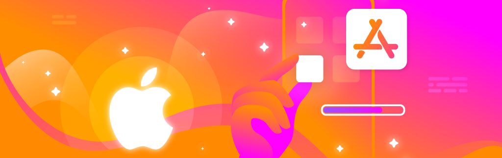

## Hi there, I'm Dom Montalto, an iOS Developer 👋🏼

👨🏼‍💻 Coding professionally since 2018  🎓 First Class Honours in Software Engineering  📫 How to reach me: [dommontalto@icloud.com](mailto:dommontalto@icloud.com)

# 💻 iOS Tech Stack:

<picture>
  <source media="(prefers-color-scheme: dark)" srcset="https://raw.githubusercontent.com/dommontalto/dommontalto/output/github-snake-dark.svg" />
  <source media="(prefers-color-scheme: light)" srcset="https://raw.githubusercontent.com/dommontalto/dommontalto/output/github-snake.svg" />
  
</picture>

  

<table>
  <tr>
    <td align="center" width="300">
      
    </td>
    <td>
      <h2 align="center">Hx</h2>
      
<strong>Hx</strong> is a smart control system for luxury homes and yachts — control lighting, heating, media, and more from a sleek, unified app interface.

      
Designed with SwiftUI and Firebase, it's built for elegance, speed, and total control — whether you're on land or at sea.

      

        
      

    </td>
  </tr>
</table>
